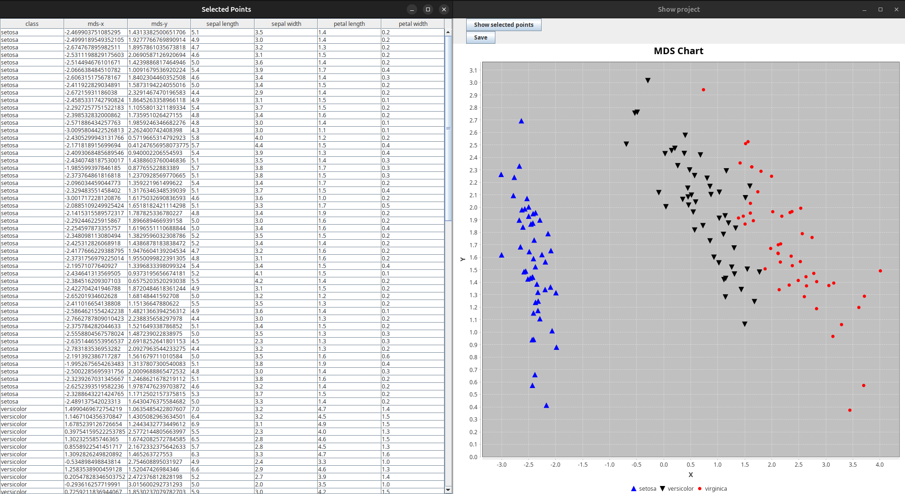

# mds-Rose

## Overview
**mds-rose** is an experimental data visualization application where users can upload their datasets and select features to analyze. It uses [MDSJ](https://www.inf.uni-konstanz.de/exalgo/software/mdsj/) algorithm to reduce dataset dimensions to 2D and visualizes results on a plot.



[](LICENSE)

## Features
- Dataset upload
- Features selection
- Euclidean distance calculation
- Outputs 2D projection

## Installation
### Prerequisites
- Java 23 or later
- Maven (for dependency management)

### Build & Run
Clone the repository:
```sh
git clone https://github.com/dwdGit/mds-rose.git
cd mds-rose
```
Compile the project using Maven:
```sh
mvn package
```
Run the application:
```sh
java -jar target/mds-rose-<version>.jar
```

## Usage
1. Signup or Login.
2. Dataset upload with _.csv_ or _.data_ extension.
   * The dataset should be structured with numerical feature columns and a label. 
   * Ensure that the file uses comma (,) delimiters. 
   * Missing values should be handled before uploading to avoid errors.
3. Features selection.
4. Label shape and color choice.
5. Points pick on plot for detailed view.
   * The application generates a scatter plot where each point represents a reduced-dimension projection of the dataset. 
   * Users can click and drag to select a rectangle on the plot, which will reveal detailed feature and MDS-calculated values for the points inside.
   * The plot differentiates labels using user-selected colors and shapes.

## License
This project is licensed under the **Apache-2.0 License**.

## Acknowledgements
* [University of Konstanz](https://www.informatik.uni-konstanz.de/): for MDJS algorithm.